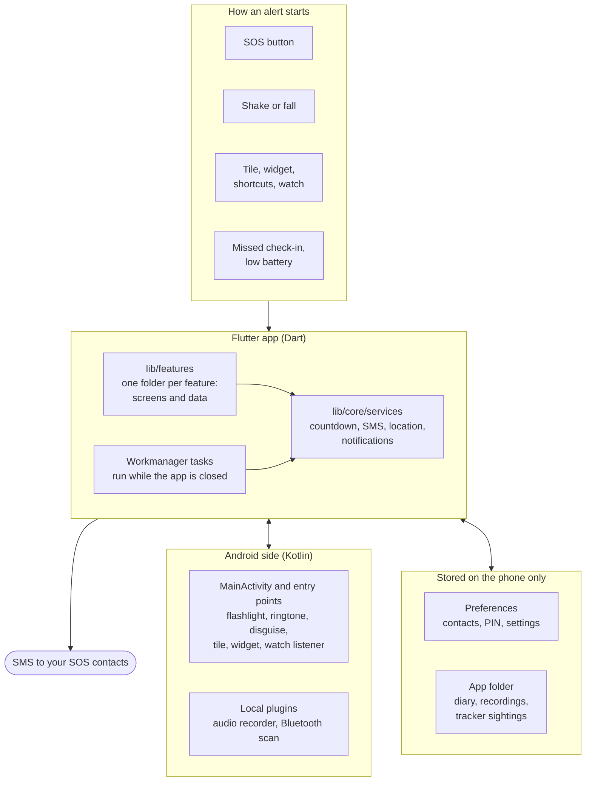

# MetJou

MetJou ("met jou", Dutch for "with you") is a personal safety app for Android, built with Flutter. One press or a shake sends an SMS with your location to up to three people you trust. Around that it has tools for getting home safely, for getting out of a bad situation and for keeping evidence.

There is no account and no server. Everything you enter stays on the phone.

Status: in development, not in a store yet. The tracker watch runs on a phone but has not been tested against a real tag.

## Features

Alerts

- SOS button: sends a help message with a map link by SMS to up to three contacts. Stopping the alert asks for your PIN and tells your contacts you are safe.
- Safe Shake: shake the phone to send the alert, also while the app is in the background. A countdown (off, 3, 5 or 10 seconds) gives time to cancel.
- Other ways to start an SOS: a Quick Settings tile, a home screen widget, app icon shortcuts and a Wear OS watch app. All of them go through the countdown.
- Fall detection: a free fall, an impact and then no movement start a countdown of at least 15 seconds.
- Low battery message: sends your last location once when the battery drops to 10%.
- Test alert: checks that your contacts receive your messages.

On the way

- Get home safe: sends your location to one contact every 1 to 30 minutes, or once at a set time. "I'm home" ends it and tells your contacts.
- Check-in timer: 15 minutes to 2 hours. If you do not check in on time, your contacts are alerted.
- Tracker watch: finds AirTags, SmartTags, Tile and other tags, and warns when one travels with you.
- Nearby safe places: police stations, hospitals, pharmacies and public transport, opened in Google Maps.

Getting out of a situation

- Fake call: a realistic incoming call, now or after a delay.
- Siren: a loud alarm with a flashing screen and flashlight.
- Quick exit: opens a weather page and closes the app.
- Discreet mode: the app shows as "Calculator", sends no status notifications and has no preview in the recent apps screen.

Evidence and information

- Incident diary: notes and photos behind your PIN, with export to PDF.
- Audio recording when you shake, in a folder you choose.
- Medical ID for first responders, also on the lock screen.
- Emergency numbers (112, 113, police 0900-8844, Veilig Thuis 0800-2000, Switchboard) and a list of Dutch help organisations.

General

- Dutch (default), English, French, Arabic and Spanish.
- Light and dark theme.
- A PIN that stops an alert and protects Settings, your contacts, the diary and the tracker screen.

Each feature is described in [docs/features.md](docs/features.md).

## Architecture



The app is feature-first: every feature has its own folder under `lib/features` with a `data` part (models, storage, rules) and a `presentation` part (screens). Code that several features share lives in `lib/core`. Alerts always end in `lib/core/services`, which sends the SMS through the phone's own provider.

Work that must happen while the app is closed (a missed check-in, the low battery message, the tracker watch) runs as Workmanager tasks in a separate Dart isolate. That isolate can only reach Android through plugins, which is why the audio recorder and the Bluetooth scan are local plugins under `plugins/`. Flashlight, ringtone and the launcher disguise are a plain channel in `MainActivity`, next to the Android entry points: the Quick Settings tile, the widget and the listener for the watch.

More detail, with the alert sequence, background tasks, storage and permissions, is in [docs/architecture.md](docs/architecture.md).

## Getting started

You need Flutter 3.47 or later, JDK 21 and the Android SDK (API 37).

```sh
flutter pub get
tool/dev.sh run
```

`tool/dev.sh` runs Flutter commands with a memory limit, which matters on a machine with 16 GB and no swap; plain `flutter run` works as well. The script, the tests and the translation workflow are described in [docs/development.md](docs/development.md).

```sh
tool/dev.sh test       # all tests
tool/dev.sh analyze    # dart analyze lib test
tool/dev.sh build      # flutter build apk --debug
```

## Documentation

| Page | What it covers |
| --- | --- |
| [docs/features.md](docs/features.md) | Every feature: what it does, how it behaves and where its code is |
| [docs/architecture.md](docs/architecture.md) | Layers, the alert sequence, background tasks, channels, storage, permissions |
| [docs/tracker-watch.md](docs/tracker-watch.md) | How trackers are recognised and when the app warns |
| [docs/development.md](docs/development.md) | Setup, building with little memory, tests, translations, Android build notes |

The same pages build into a site with MkDocs. Preview it with `docs/serve.sh`.

## Project structure

```text
lib/
  main.dart            startup, shake handler
  app.dart             MaterialApp, theme, localisation
  core/                shared by all features
    localization/      locale controller, language picker
    navigation/        navigator key for code outside the widget tree
    services/          alerts (SMS, location, notifications), countdown,
                       launch actions, discreet mode, fall detection
    theme/             colours and theme
    widgets/           shared widgets (glass panels, PIN sheet, countdown)
  features/<feature>/  check_in, contacts, diary, emergency, fake_call,
                       get_home_safe, home, legal, medical_id, onboarding,
                       resources, safe_places, settings, siren, splash,
                       tracker_watch
    data/              models, storage and rules
    presentation/      screens, widgets/ for feature-only widgets
  l10n/                ARB translations and generated code
plugins/
  audio_background_record/   foreground-service audio recorder
  tracker_scan/              Bluetooth LE scan, live scan, one GATT write
android/app/           MainActivity, Quick Settings tile, widget, watch listener
android/wear/          Wear OS SOS app (native Kotlin)
assets/legal/          privacy policy and terms (English, Dutch)
docs/                  documentation
tool/dev.sh            Flutter commands with a memory limit
test/                  mirrors lib/
```

## Wear OS app

`android/wear` is a small watch app with one SOS button. It sends the press to the paired phone (Wearable Data Layer), which starts the SOS countdown. It shares the phone app's application ID and must be signed with the same key.

```sh
cd android && ./gradlew :wear:assembleDebug
```

## Credits

Tracker watch: the advert patterns, the sound commands and the rule for a tracker that travels along follow [AirGuard](https://github.com/seemoo-lab/AirGuard) (TU Darmstadt, Apache-2.0).

The help and information carousel shows previews of the organisations' own websites (Veilig Thuis, Centrum Seksueel Geweld, Slachtofferhulp Nederland, 113 Zelfmoordpreventie, Switchboard, Politie, Rijksoverheid), taken from their Open Graph images or homepage headers. They remain the property of those organisations.

Font: Readex Pro, SIL Open Font License 1.1 (assets/fonts/OFL.txt).

Colours: Catppuccin (Latte for light, Mocha for dark), MIT licence, catppuccin.com.

## Origin

Based on the [M3ak prototype](https://github.com/adam-bouafia/M3ak-Mobile-Application-Prototype), originally developed in Tunisia in 2022.
