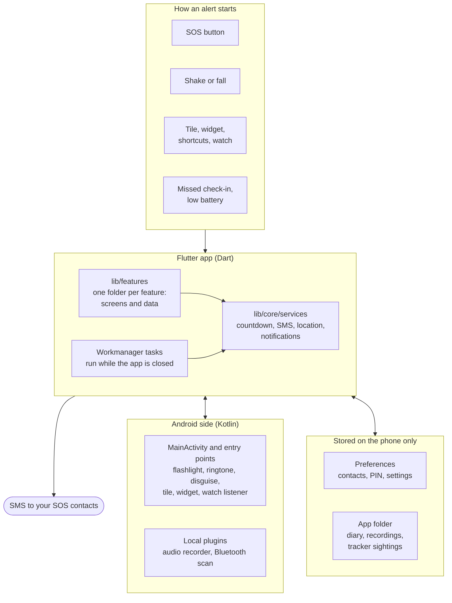
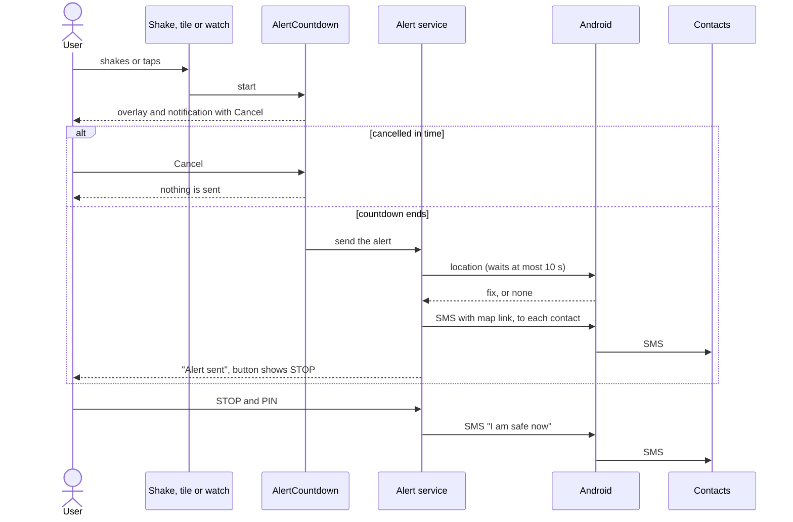

# Architecture

## Overview

There is no backend. The only things that leave the phone are SMS messages to your contacts, phone calls you start, and web pages or maps you open.

## Layers

The app is feature-first.

| Where | What belongs there |
| --- | --- |
| `lib/features/<feature>/data` | Models, storage and rules of one feature. No widgets. Rules are plain functions where possible, so they can be tested without a phone. |
| `lib/features/<feature>/presentation` | Screens and widgets of that feature. |
| `lib/core/services` | What several features share: sending alerts, location, notifications, the countdown, launch actions, discreet mode. |
| `lib/core/widgets`, `theme`, `localization`, `navigation` | Shared UI pieces, colours, language handling, and a navigator key for code that opens screens from outside the widget tree. |
| `plugins/` | Android code that must also work in a background isolate. |
| `android/app` | `MainActivity` and the Android entry points (tile, widget, watch listener). |

A feature may use `core` and, where it makes sense, another feature's `data` (Get home safe starts the faster tracker scans, for example). `core` does not depend on screens of a feature, except for the launch actions, which open them.

## An alert, step by step

"Alert service" is `BackgroundServices` in `lib/core/services`. The SOS button in the app skips the countdown: pressing it is deliberate. Everything else goes through `AlertCountdown`, whose length is a setting (off, 3, 5 or 10 seconds); a detected fall always gets at least 15 seconds.

## Work in the background

Two mechanisms keep things going when the app is not on screen.

**A foreground location service.** While Safe Shake or a repeating Get home safe is on, a foreground service with a location stream keeps the app's process alive. The shake listener, the Get home safe timer and the faster tracker scans run inside that process.

**Workmanager tasks.** They start a separate Dart isolate even when the app was closed. `callbackDispatcher` in `core/services/background_services.dart` routes them:

| Task | When | What it does |
| --- | --- | --- |
| `get-home-safe-once` | Once, at the time you chose | Sends your location to the chosen contact |
| `check-in-missed` | Once, at the check-in deadline | Alerts your contacts if you did not check in |
| `low-battery-check` | About every 15 minutes | Sends one message at 10% battery |
| `tracker-watch` | About every 15 minutes | Scans for trackers, stores sightings, warns |

Android may delay these tasks by a few minutes, longer in battery saving.

A task isolate has no `MainActivity`, so it can only call Android through plugins. Its settings come from `SharedPreferences`, which it reloads on every run because the app may have changed them.

## Dart and Android

| Channel | Where | Used for |
| --- | --- | --- |
| `metjou/device` | `MainActivity.kt`, wrapped by `core/services/device.dart` | Flashlight, volume, ringtone, the calculator disguise, hiding the recent apps preview, and launch actions from the tile, widget and watch |
| `audio_background_record` | `plugins/audio_background_record` | Recording in a foreground service, folder picker |
| `metjou/tracker_scan` | `plugins/tracker_scan` | Bluetooth state, a timed scan, one write to a device |
| `metjou/tracker_scan/live` | `plugins/tracker_scan` | A stream of adverts for the finder |

The tracker plugin knows nothing about trackers. Dart passes the scan filters and the bytes to write, so all tracker knowledge stays in Dart, where it is unit-tested.

## What is stored, and where

| Data | Where |
| --- | --- |
| SOS contacts, PIN, settings, fake caller name, Medical ID, running Get home safe and check-in | `SharedPreferences` |
| Incident diary | `diary/entries.json` and the photos, in the app's documents folder |
| Audio recordings | `recordings/` in the app's documents folder, or the folder you picked |
| Tracker sightings | `trackers/sightings.jsonl` in the app's documents folder, one line per sighting, removed after 14 days |
| Ignored trackers, last warning per tracker | `SharedPreferences` |

The sightings file is only ever appended to, so the app and the background task can both write without overwriting each other.

## Permissions

| Permission | Used for |
| --- | --- |
| SMS | Sending alerts |
| Phone | Calling emergency and help numbers directly |
| Location, also in the background | The map link in alerts, Safe Shake, Get home safe, the place of a tracker sighting |
| Foreground service (location, microphone) | Safe Shake and Get home safe in the background, audio recording |
| Microphone | Audio recording, only when you turn it on |
| Notifications | Countdown, check-in, fake call, Medical ID, tracker warning, and the status of Safe Shake and recording |
| Nearby devices (Bluetooth scan and connect) | Tracker scan and watch, making a tracker play a sound |
| Internet | Opening maps and websites; the app itself calls no server |

## Design decisions

- **SMS, not push.** An SMS needs no account on either side and no server that can be down.
- **Countdown before automatic alerts.** A false alarm costs trust. Shake, fall, tile, widget and watch can all be cancelled.
- **Rules as plain functions.** The fall rule, the low battery rule and the tracker rule take values and return a decision, so they are tested with tables of cases.
- **Local plugins only where needed.** Flashlight and ringtone stay in `MainActivity`; recording and Bluetooth are plugins because background isolates need them.
- **No notification in discreet mode.** A notification header always shows the real app name, so in discreet mode status notifications and tracker warnings stay inside the app.
