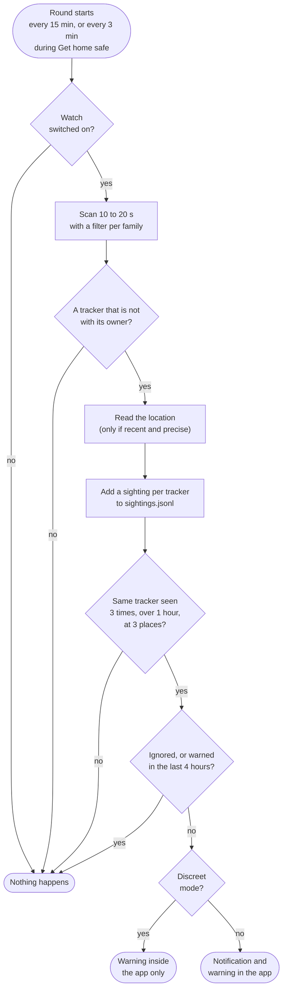

# Tracker watch

Small Bluetooth tags such as AirTags are made to find lost keys, and are also misused to follow people. The tracker watch finds such tags near the phone and warns when one keeps travelling with you. Everything happens on the phone.

## What it recognises

A tag broadcasts a short Bluetooth LE advert every few seconds. Each family has its own pattern, which Android can filter on.

| Family | Recognised by | Says where its owner is |
| --- | --- | --- |
| AirTag, other Find My tags, AirPods | Apple manufacturer data, type `0x12` | Yes |
| Samsung SmartTag | Service data `0xFD5A` | Yes |
| Google Find Hub tags | Service data `0xFEAA`, frame `0x40` or `0x41` | Yes |
| Chipolo (own network) | Service `0xFE33` | Older firmware only |
| Tile | Service data `0xFEED` | No |
| Pebblebee (own network) | Service `0xFA25` | No |

Phones and laptops in Find My mode send the same Apple advert type. They are not tags and are left out.

Each tracker gets an owner state: **with its owner**, **away from its owner**, or **unknown**. A tag that was planted on someone is away from its owner. That is why only "away" and "unknown" trackers are stored and counted: the tags of other passengers on a train are with their owners and never trigger a warning.

Code: `lib/features/tracker_watch/data/tracker_signature.dart`.

## Scan now

One scan of 10 seconds. The screen lists what is near, trackers away from their owner first, with a rough distance from the signal strength and a short code (the end of the tracker's id). The same code at another place means the same tracker.

With the background watch off, nothing is stored and the location is not read.

## Watching in the background



### The rule

A tracker counts as travelling with you when, within the last 24 hours, it was seen

- at least 3 times,
- with at least 60 minutes between the first and the last sighting,
- at 3 or more places that are more than 150 m apart.

Tile and Pebblebee tags never say whether their owner is near, so they need one place more.

While Get home safe is sending your location, the app scans every 3 minutes and uses a stricter rule: 30 minutes and 2 places.

The numbers follow the AirGuard app (medium and high sensitivity). A tracker that stays at one place, such as a neighbour's lost tag at home, never meets the rule.

Code: `follow_detector.dart` (the rule), `tracker_watch.dart` (rounds, storing, warnings).

### Places

A sighting gets the phone's location only when the fix is less than five minutes old and accurate to 100 m. A stale or jumping location would look like a new place and cause false warnings.

### The same tracker over time

Trackers change their Bluetooth address to protect their owner's privacy. An AirTag away from its owner keeps its address for about a day, which is long enough to count sightings. A SmartTag changes its id every 15 minutes, but its advert carries a counter that goes up once per 15 minutes from the day the tag was set up. "Counter times 15 minutes, minus the clock" stays the same for one tag and differs between tags, so sightings of one SmartTag are linked through it.

### Warnings

At most one warning per tracker every 4 hours, and only for a tracker seen in the current round. Tapping the notification opens the tracker screen, after the PIN. The home card also shows the warning.

## Per tracker

The detail screen offers:

- **Find it**: a live signal meter. Walk around and watch it grow.
- **Play sound**: connects to the tracker and asks it to ring. Works for AirTags, Find My tags, Google tags and Pebblebee tags; SmartTags, Tile and Chipolo only ring for their owner.
- **Save to diary**: a diary entry with the kind, code, times and map links of the sightings.
- **Ignore**: for a tracker you know, such as a housemate's keys.
- **What you can do**: six steps, with call buttons for 112, the police, Slachtofferhulp and Veilig Thuis.

## Data

| What | Kept where | For how long |
| --- | --- | --- |
| Sightings: kind, id, address, time, signal, place | `trackers/sightings.jsonl` in the app folder | 14 days, or until Delete history |
| Ignored trackers, time of the last warning | Preferences | Until you delete the history or the app |

Nothing is sent anywhere. A sighting only leaves the phone if you save it to the diary and export the diary.

## Limits

- It finds Bluetooth tags of the families above. It does not find GPS trackers or tags of another kind.
- A warning is a reason to check, not proof.
- Android may delay the background rounds, so a warning can come later than the rule suggests.
- A Google tag only counts once it reports being away from its owner, which takes some hours.
- Play sound uses the address of the last sighting. If the tracker changed its address since, use Find it or Scan now first.
- Recognition has run on a phone, but the warning, SmartTag linking and Play sound have not been tested against real tags.

## Checking it on a phone

In a debug build every advert that passes the filters is printed, with what the app made of it:

```text
tracker_scan C4:CF:25:47:8B:37 -72 dBm not a tracker {company 4c: 12020003}
```

This one is an Apple phone or laptop in Find My mode: type `12`, length `02`, device type 0. An AirTag away from its owner would show `airTag` and a payload starting with `1219`.

For a test of the warning you need a tag that is away from its owner's phone. A SmartTag paired to the test phone itself shows as "with its owner".

## Credits

The advert patterns, the sound commands and the rule follow the open-source [AirGuard](https://github.com/seemoo-lab/AirGuard) app (TU Darmstadt, Apache-2.0).
